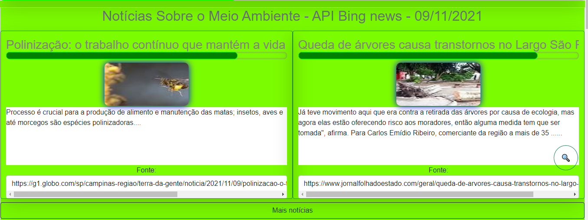
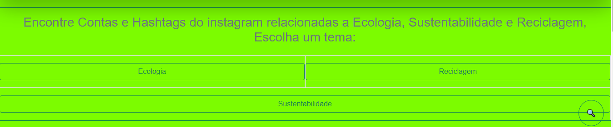
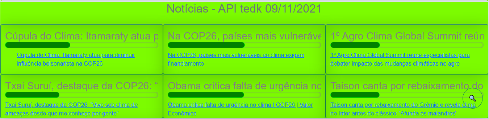
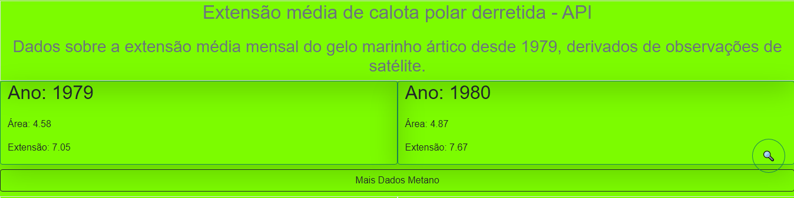
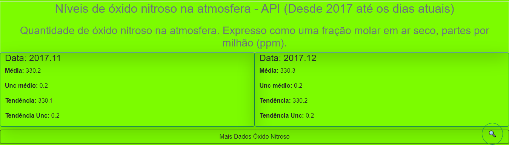

# Dicas_de_APIs
 
<h1>Dicas de APIs, Algumas das APIs que testei, mais dicas.</h1>

<ul>
    <li>API_Bing_News</li>
    <li>API_climate_change_news</li>
    <li>API_CocktailDB</li>
    <li>API_Concentração_de_metano</li>
    <li>API_Dados_COVID_19</li>
    <li>API_Gelo_polar_derretido</li>
    <li>API_google_search</li>
    <li>API_IMDB_Banco_de_dados_de_filmes</li>
    <li>API_instagram</li>
    <li>API_Instagram_2</li>
    <li>API_Newscatcher</li>
    <li>API_Niveis_de_oxido_nitroso</li>
    <li>API_noticias_crossref</li>
    <li>api_noticias_tedk</li>
    <li>API_TRADUCAO</li>
</ul>

<h2>OBS: Nas pastas tem um código básio para testar, mas é nessessário acessar sua conta no <a href="https://rapidapi.com/hub" target="_blank">https://rapidapi.com/hub</a> Para poder pegar as chaves para funcionar o teste!</h2>

<h3>As APIs das imagens estão funcionando no meu site pessoal: <a href="https://www.recicladarte.com/">https://www.recicladarte.com/</a></h3>

